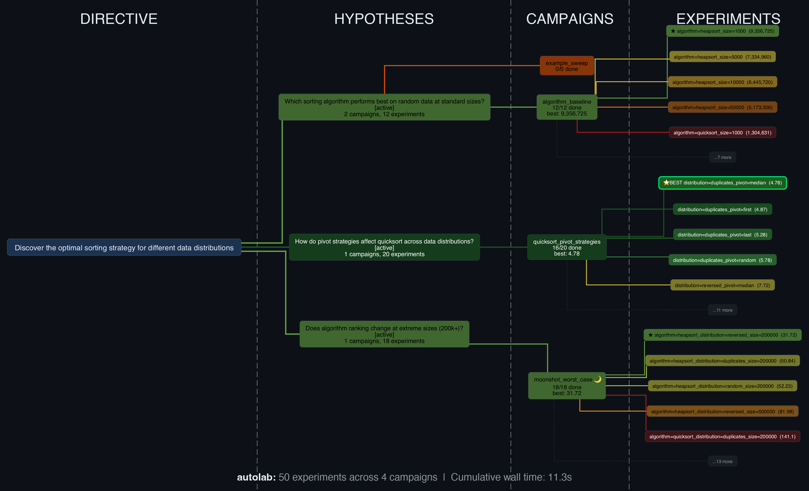

# Autolab



Autonomous research orchestration framework. Give it a research goal, and it designs experiment campaigns, runs them, analyzes results, and documents novel discoveries.

Autolab builds on the [autoresearch](https://github.com/karpathy/autoresearch) paradigm pioneered by Andrej Karpathy. Where autoresearch excels at optimizing a single metric in a tight loop, Autolab extends the idea to orchestrate **research programs** — multi-question investigations with campaign-based experiment design, literature-informed hypothesis generation, and rigorous discovery documentation.

## Quickstart

```bash
pip install autolab

# Initialize a research project
autolab init "Optimize transformer inference latency on consumer GPUs"

# Run a campaign
autolab run campaigns/000_example.yaml

# Check status
autolab status

# Query results
autolab results --metric throughput --top 5

# Start autonomous research loop (requires API key)
export ANTHROPIC_API_KEY=sk-...
autolab loop --backend anthropic --max-iterations 10
```

## How It Works

```
Research Directive (human)
    |
    v
Goal Decomposition --> Research Questions
    |
    v
Campaign Design --> YAML parameter grids
    |
    v
Experiment Execution --> Local, SSH, Docker, SLURM
    |
    v
Results Analysis --> SQLite DB, trend detection
    |
    v
Discovery Documentation --> DISCOVERIES.md with prior art verification
    |
    v
Repeat (with escape strategies when stuck)
```

Each research iteration follows the cycle:
1. **Orient** — read journal, query DB, check progress
2. **Hypothesize** — form testable question, write it down first
3. **Design** — create campaign YAML targeting the hypothesis
4. **Execute** — `autolab run campaigns/name.yaml`
5. **Analyze** — query results, compare to baselines
6. **Document** — update journal, add discoveries
7. **Commit** — git commit the iteration

## Campaign Format

```yaml
version: 1
name: batch_size_sweep
hypothesis: "Batch sizes >32 show diminishing throughput gains"
question: q1
moonshot: false

runner:
  backend: local                    # local | ssh
  command: "python train.py --batch-size {batch_size} --lr {lr}"
  working_dir: ./experiments
  timeout_seconds: 3600

defaults:
  lr: 0.001

grid:
  batch_size: [8, 16, 32, 64, 128]  # 5 experiments (Cartesian product)

metrics:
  primary: throughput
  direction: maximize
  collect:
    - name: throughput
      pattern: "Throughput: ([\\d.]+)"
    - name: loss
      pattern: "Loss: ([\\d.]+)"

stopping:
  window: 3
  threshold: 0.05
  max_failures: 3
```

## LLM Agent Support

Autolab is LLM-agnostic. The research loop can be driven by:

| Backend | How | Best for |
|---|---|---|
| **Claude Code** | Plugin with Ralph Wiggum loop | Richest: skills, hooks, native tools |
| **Anthropic API** | `autolab loop --backend anthropic` | Direct API, any Claude model |
| **OpenAI API** | `autolab loop --backend openai` | GPT-4o, o1, o3 |
| **OpenAI-compatible** | `autolab loop --backend openai-compatible --base-url ...` | Ollama, vLLM, Together, OpenRouter |
| **DeepSeek** | `autolab loop --backend deepseek` | DeepSeek V4 family (thinking-aware) |

Note that **Claude Code** is driven by the plugin (`/autolab:research-loop`), not by
`autolab loop` — setting `backend: claude-code` and running `autolab loop` will tell you so.

The executing model is **swappable by design**: campaigns, runners, metrics, and
project state are model-independent, and each provider declares its own endpoint,
key variable, default model, and request quirks in a profile. Switching models is
one line in `autolab.yaml`; adding a provider autolab doesn't ship is a `.py` file
dropped into `~/.autolab/providers/` or `./providers/` — no autolab edit.

```bash
autolab providers   # backends, default models, and whether each key is set
```

See [docs/providers.md](docs/providers.md) for the profile contract.

### Thinking-mode models

DeepSeek's V4 family defaults thinking ON when `extra_body.thinking` is unset. The API
then returns `reasoning_content` and requires later turns to echo it back — and since the
agent harness replays the full message history on every tool round, a backend that drops
that field fails with HTTP 400 `reasoning_content must be passed back` immediately after
its first tool call. Autolab sends the thinking flag explicitly and round-trips
`reasoning_content`, so V4 works with tool use out of the box:

```yaml
agent:
  backend: deepseek           # defaults to deepseek-v4-pro + DEEPSEEK_API_KEY
  thinking: true              # default; sent explicitly either way
  reasoning_effort: high      # low | medium | high | max (omit for provider default)
```

The same handling applies to routed ids such as `deepseek/deepseek-v4-pro` over
OpenRouter. DeepSeek V3 is deliberately excluded — its wire format has no thinking block.

## Claude Code Plugin

Install the plugin for the richest experience:

```
/research-loop     Start autonomous research marathon
/campaign create   Design a new campaign
/campaign run      Run a campaign
/status            Check progress
/literature        Search prior art
/discover          Document a finding
```

The plugin includes skills for research loop protocol, campaign design, and discovery writing, plus a Ralph Wiggum stop hook for long-running autonomous sessions.

## Moonshot Budget

Autolab enforces that **50% of campaigns** (configurable) should be moonshots — experiments that challenge fundamental assumptions rather than incrementally tweaking parameters. This prevents convergence on local optima.

```yaml
# autolab.yaml
strategy:
  moonshot_ratio: 0.5     # 50% default
  enforce: soft            # soft | hard
```

## Escape from Local Minima

When the agent hasn't improved for 3+ consecutive iterations, Autolab triggers escape strategies:
- **Literature search** — find untried approaches
- **Devil's advocate** — argue against current approach, try the opposite
- **Random perturbation** — explore far outside tested parameter ranges
- **New question** — pivot to a completely different angle

## Discovery Attribution

Discoveries made with Autolab include attribution in DISCOVERIES.md:

> *Discovered with [Autolab](https://github.com/t8/autolab) — autonomous research orchestration*

See [ATTRIBUTION.md](ATTRIBUTION.md) for publication guidelines.

## Project Structure

```
autolab/
├── src/autolab/
│   ├── core/          Campaign engine, research loop, plan, scheduler
│   ├── agents/        LLM backends (Anthropic, OpenAI, compatible APIs)
│   ├── runners/       Experiment execution (local, SSH)
│   ├── metrics/       Collectors, SQLite DB, trend analysis
│   ├── intelligence/  Literature search, escape strategies, discovery management
│   ├── state/         Project state, journal, git integration
│   └── scaffold/      Project initialization templates
├── plugin/            Claude Code plugin (commands, skills, hooks)
├── examples/
│   ├── ml-optimization/        Hyperparameter tuning
│   ├── distributed-inference/  Pipeline parallelism optimization
│   └── algorithm-design/       Sorting algorithm comparison
└── tests/             118 tests
```

## Examples

### ML Optimization
```bash
cd examples/ml-optimization
PYTHONPATH=../../src python3 -m autolab.cli run campaigns/001_lr_sweep.yaml
```

### Distributed Inference
```bash
cd examples/distributed-inference
PYTHONPATH=../../src python3 -m autolab.cli run campaigns/001_stage_count.yaml
```

### Algorithm Design
```bash
cd examples/algorithm-design
PYTHONPATH=../../src python3 -m autolab.cli run campaigns/001_algorithm_comparison.yaml
```

## Development

```bash
git clone https://github.com/t8/autolab.git
cd autolab
pip install -e ".[dev]"
pytest tests/ -v
```

## Inspiration

Autolab stands on the shoulders of:

- **[Andrej Karpathy](https://github.com/karpathy/autoresearch)** — whose autoresearch concept proved that LLMs can autonomously run meaningful experiments. Autolab extends this from single-metric optimization to multi-hypothesis research programs.
- **[Geoffrey Huntley](https://ghuntley.com/loop/)** — who created the Ralph Wiggum loop technique for keeping Claude Code running autonomously. Autolab's research marathon mode is built on this pattern.

## License

Apache 2.0. See [LICENSE](LICENSE) and [ATTRIBUTION.md](ATTRIBUTION.md).
